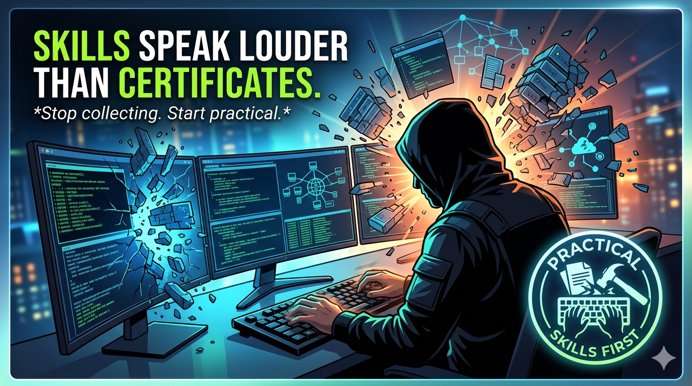

# Cybersecurity Articles

This repository contains cybersecurity articles written while learning and exploring different topics in cybersecurity.

---

## Articles

  
  
- Understanding the key difference between ethical hacking and cybercrime — and why permission is the line that separates them.
  
- [The Thin Line Between Ethical Hacking and Cybercrime](articles/ethical-hacking-vs-cybercrime.md)
---

[Case Study on Axios npm Supply Chain Attack](articles/Case-Study-on-Axios-npm-Supply-Chain-Attack.md)

- A real-world case study on how a trusted npm package was compromised and used to deliver malware through a supply chain attack.
---

### [Stop Collecting Certificates! Focus on Real Skills Instead.](articles/certifications-vs-skills.md)

- A reality check on why course completion certificates won't get you a job and why practical skills are the priority.

---
## Author

Parth Joshi  
Cybersecurity Learner | Cybersecurity Researcher
